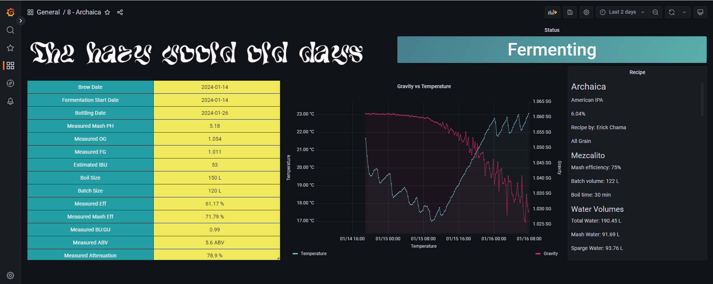
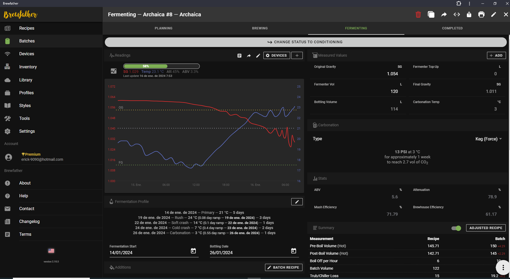

# brewing-monitor

Inspired by mexican nano brewery: 505, this is a raspberry pi based brewing monitor which is synced to BrewFather to keep track of the most recent active batch.
It also listens to tilt hydrometer readings and send them to a brewfather custom string while at the same time store them on a local Influx database to visualize both brewfather batch data and readings with a customizable Grafana dashboard.
MQTT is also configurable to toggle sending tilt messages to a local or cloud Broker

## Features

- BrewFather integration
- InfluxDB integration 
- MQTT integration
- Grafana visualization


## Screenshots

 

## Deployment

To deploy this project run

```bash
  git clone https://github.com/erickchama/brewing-monitor
```


## Authors

👽 [@erickchama](https://github.com/erickchama)

